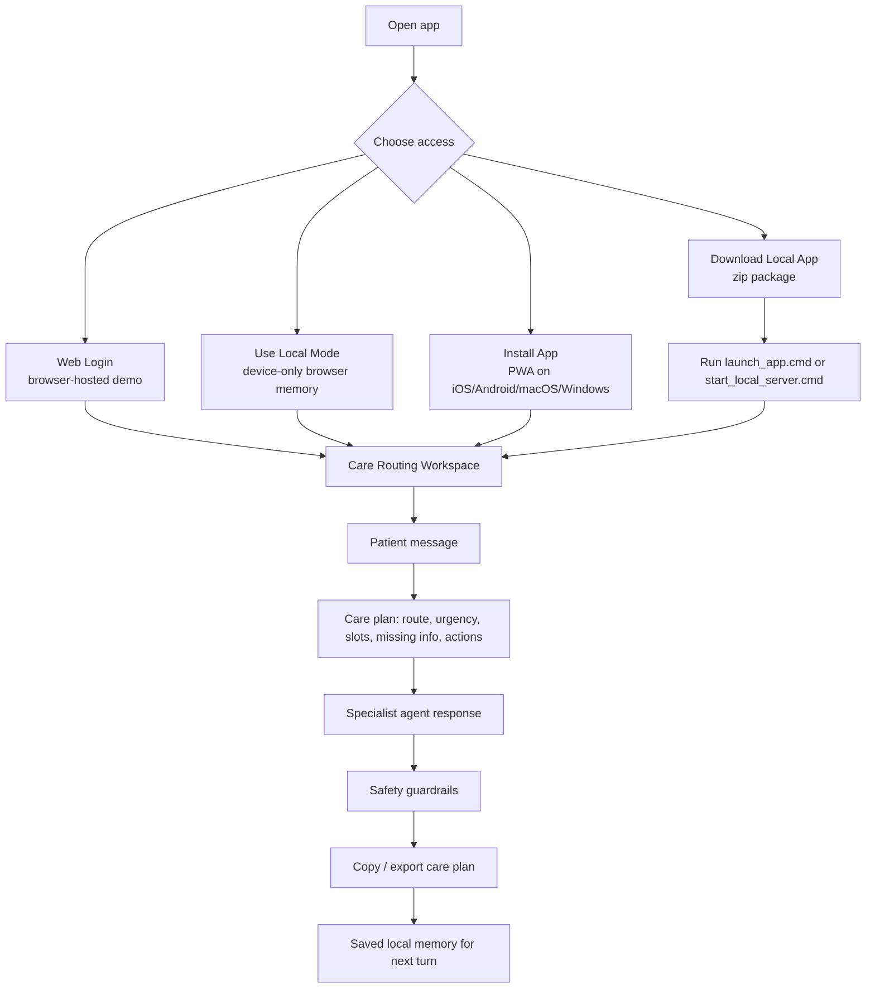
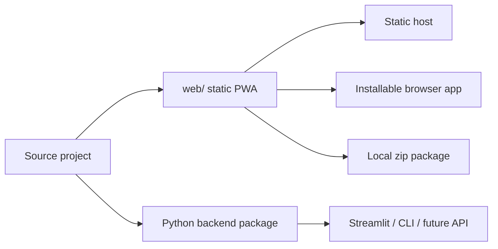

# Healthcare Agent Usage Architecture

This project has three simple ways to use the same agent.

## Recommended Entry Points

| Need | Use | Best For |
| --- | --- | --- |
| Quick local demo | `launch_app.cmd` | Windows laptop or desktop demo. Opens the browser automatically. |
| Browser installable app | `web/` served locally or by any static host | iOS, Android, macOS, and Windows users. |
| Downloadable offline-style package | `web/downloads/healthcare-agent-local.zip` | Sharing a self-contained local demo package. |
| Python developer UI | `streamlit_app.py` | Backend debugging and Python workflow inspection. |

## User Flow

## Runtime Layers

| Layer | Responsibility | Files |
| --- | --- | --- |
| Launch shell | Logo, login/local/install/download choices. | `web/index.html`, `web/app.css`, `web/app.js` |
| Agent workspace | Chat, route metrics, profile memory, extracted context, agent actions. | `web/index.html`, `web/app.js` |
| Workspace commands | New case, copy care plan, export care plan, mobile Library/Chat/Insights tabs. | `web/index.html`, `web/app.css`, `web/app.js` |
| Static PWA runtime | Manifest, install metadata, cache strategy, app icons. | `web/manifest.webmanifest`, `web/service-worker.js`, `web/icons/` |
| Local server | Serves the static app on `localhost`, opens a browser, finds an available port. | `serve_local.ps1`, `launch_app.cmd`, `start_local_server.cmd` |
| Backend agent package | Python workflow, specialists, memory, safety, optional LangGraph. | `healthcare_agent/` |
| Demo data | Health topics, medications, appointments, alerts. | `data/`, `web/data/` |

## Which Mode Stores What

| Mode | App Code Location | Memory Location | Network Required After Load |
| --- | --- | --- | --- |
| Web Login | Hosted static site | Browser `localStorage` under selected patient ID | Usually no for demo data after cache |
| Local Mode | Hosted or local static site | `.localhost_store/` when running from localhost; browser storage otherwise | No for cached PWA; no when served from local zip |
| Download Local App | Extracted zip on user machine | `.localhost_store/` in the extracted app folder | No external app server |
| Streamlit | Python process | `.agent_memory/` JSON files | No, unless optional integrations are enabled |

## Localhost Store

The Windows local launcher exposes a small same-origin store at `/api/local-store`. The web app uses it only on `localhost`, `127.0.0.1`, or `::1`. Saved keys are encoded into files under `.localhost_store/`; browser storage remains the fallback for hosted or installed PWA use.

## Deployment Shape

## Easy Demo Script

1. Double-click `launch_app.cmd`.
2. Browser opens at the local app.
3. Choose **Use Local Mode**.
4. Try:
   - `I have a headache for two days`
   - `What are ibuprofen side effects?`
   - `Schedule an appointment`
   - `I have chest pain and cannot breathe`

## Production Boundary

This architecture is demo-friendly. For production, add authentication, consent, encrypted PHI storage, reviewed clinical content, API-backed scheduling, caregiver alert delivery, monitoring, and a medically reviewed safety policy.
