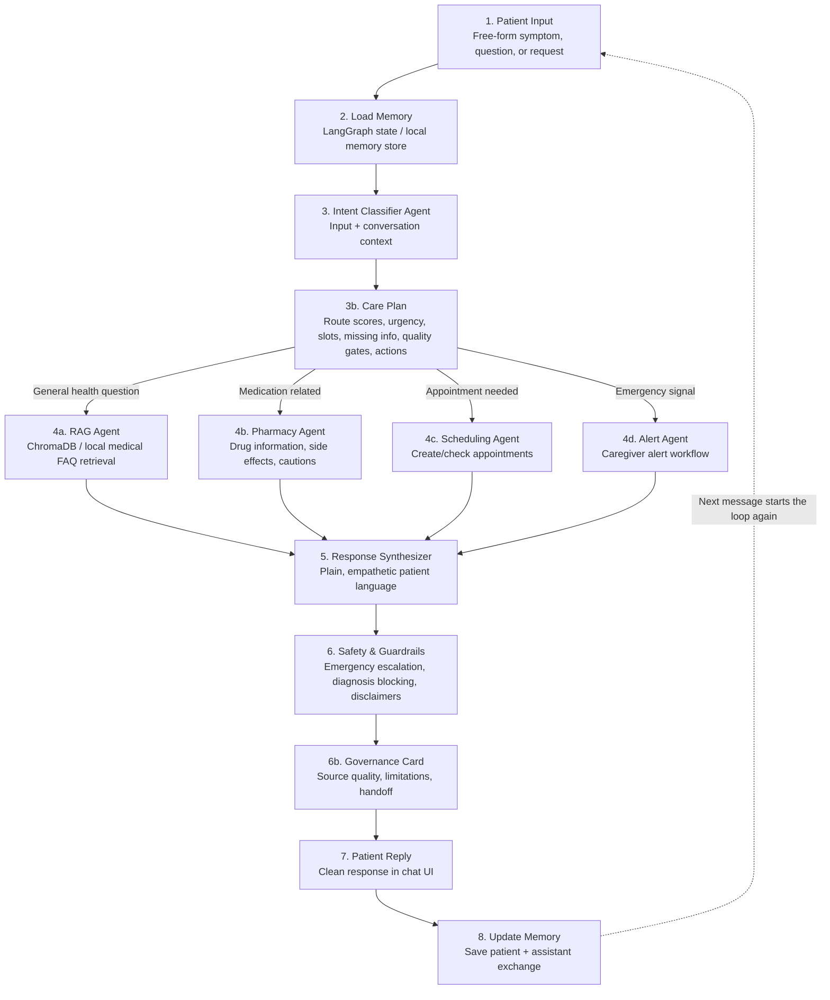

# Healthcare Agent Architecture

This project implements a continuous healthcare assistant loop using patient input, stateful memory, intent routing, specialist agents, response synthesis, and safety guardrails.

## End-to-End Flow

## Step Mapping

| Step | Purpose | Implementation |
| --- | --- | --- |
| Patient Input | Accept free-form patient text such as symptoms, medication questions, or appointment requests. | `streamlit_app.py`, `web/index.html`, `web/app.js` |
| Memory Store | Load prior conversation context before routing. | `healthcare_agent/memory.py`, `healthcare_agent/graph.py` |
| Intent Classifier Agent | Route to one of four care paths with route scores, urgency, reasoning, extracted slots, missing information, quality gates, and planned actions. | `healthcare_agent/classifier.py` |
| RAG Agent | Retrieve general health knowledge from medical FAQ data and ChromaDB when available. | `healthcare_agent/specialists.py`, `data/medical_faqs.json` |
| Pharmacy Agent | Look up medication purpose, general guidance, side effects, and cautions. | `healthcare_agent/specialists.py`, `data/drugs.json` |
| Scheduling Agent | Check upcoming appointments or create appointment requests. | `healthcare_agent/specialists.py`, `data/appointments.json` |
| Alert Agent | Detect urgent danger signals and log or send caregiver alerts. | `healthcare_agent/specialists.py`, `data/alerts.json` |
| Response Synthesizer | Convert raw specialist output into patient-friendly language. | `healthcare_agent/synthesizer.py` |
| Safety & Guardrails | Add disclaimers, soften diagnosis-like language, and escalate emergencies. | `healthcare_agent/safety.py` |
| Governance Card | Expose intended use, decision role, source quality, limitations, risk controls, and handoff recommendation. | `healthcare_agent/governance.py`, `web/app.js` |
| Patient Reply | Display final response in the UI. | `streamlit_app.py`, `web/app.js` |
| Update Memory | Persist the completed exchange for the next turn. | `healthcare_agent/graph.py`, `healthcare_agent/memory.py` |

## Care Plan Layer

Before specialist routing, the classifier builds a structured care plan. It includes:

- `route_scores` for alert, pharmacy, scheduling, and RAG paths.
- `secondary_intents` for mixed requests so emergency handling can stay first while medication, scheduling, or other follow-up needs are preserved.
- `urgency_level` for routine, watch, urgent, or emergency handling.
- `clinical_slots` such as symptoms, medication names, dose, duration, severity, appointment timing, medication risk factors, age group, red flags, negated red flags, and patient-reported readings.
- Measurement-aware triage signals from patient-reported oxygen saturation, blood sugar, temperature, blood pressure, and pulse readings.
- Negation-aware emergency parsing so phrases like "no chest pain" are captured without falsely overriding the route.
- `missing_information` so the assistant asks for concrete missing details instead of generic follow-ups.
- `quality_gates` so low-confidence, ambiguous, or under-specified turns are blocked or marked for watchful clarification before the agent relies on a specialist result.
- `agent_actions` with completed, queued, or blocked status for the workflow steps taken during the turn.
- `model_efficiency` metadata for routing mode, memory messages used, profile signals considered, clinical slots extracted, measurement signals considered, planned specialist calls, and deferred secondary specialist calls.
- `workflow_trace` with the eight requested steps, from patient input through memory update, so each turn can be audited.
- `governance_card` with source quality, intended use, decision role, limitations, risk controls, and human handoff recommendation.

The web UI mirrors this plan in the right-side workspace, making routing, quality gates, task state, source quality, handoff, and the full loop trace inspectable during demos.

## Specialist Agents

### RAG Agent

The RAG Agent answers general health questions by searching the local medical FAQ dataset. It expands very short follow-up questions with recent patient memory and profile signals so questions like "What about it?" can retrieve the prior symptom topic. If ChromaDB is installed, the same dataset is indexed into a local persistent vector store using offline hash embeddings for demo-friendly retrieval. If ChromaDB is unavailable, the agent falls back to keyword scoring.

### Pharmacy Agent

The Pharmacy Agent handles medication-related questions. It recognizes generic names and common aliases, then returns general medication use, label-following guidance, side effects, cautions, and source metadata. It does not provide personalized dosing.

### Scheduling Agent

The Scheduling Agent checks local appointment data for upcoming visits or creates a requested appointment slot. In a production version, this layer can be replaced with a calendar API integration.

### Alert Agent

The Alert Agent handles emergency signals such as chest pain, stroke-like symptoms, severe breathing trouble, overdose language, or self-harm language. In demo mode it logs alerts locally. With Twilio credentials and `ENABLE_REAL_ALERTS=true`, it can send SMS alerts to a caregiver.

## Safety Model

The safety layer runs after specialist output and before the patient sees the final response.

It performs four main checks:

1. Emergency escalation: urgent symptoms override normal answers.
2. Diagnosis blocking: diagnosis-like phrasing is softened.
3. Medical disclaimers: general health and medication answers clearly say they are not a diagnosis.
4. Medication safety: medication responses remind patients to follow labels or prescriber instructions.

## Governance Layer

The governance layer runs after safety checks and before memory update. It labels each turn with:

- intended use and decision role,
- trusted, local/unverified, or missing source support,
- quality gates that passed, watched, or blocked the turn,
- known limitations,
- recommended human handoff level,
- risk controls applied during the turn.

Trusted source detection recognizes official and patient-facing medical domains used by the project, including CDC, FDA, HealthIT.gov, MedlinePlus, NIH/NLM, and WHO.

## Memory Loop

Each conversation turn follows this sequence:

1. Load patient memory.
2. Classify the current message with memory context.
3. Route to a specialist.
4. Synthesize and guardrail the reply.
5. Save the patient message and final assistant response back to memory.

Every backend response includes `workflow_trace`, with one completed entry for patient input, memory loading, classifier routing, specialist execution, response synthesis, safety guardrails, patient reply preparation, and memory update. The same trace is saved in memory metadata for later audit.

That saved state makes the next patient message continuous instead of isolated.

## Demo and Deployment Surfaces

| Surface | Purpose |
| --- | --- |
| `web/` | Static browser version used by the local launcher and any static host. |
| `streamlit_app.py` | Hackathon-friendly Python chat UI. |
| `healthcare_agent/` | Reusable backend workflow and agent logic. |
| `data/` | Local medical, drug, appointment, and alert data. |

## Production Upgrade Path

The current project is intentionally demo-friendly. For production-grade use, replace the local fallbacks with reviewed services:

- Use a reviewed medical content corpus and clinical approval process.
- Use real embeddings and ChromaDB or a managed vector database.
- Connect Scheduling Agent to a calendar or EHR scheduling API.
- Connect Alert Agent to Twilio SMS, email, and caregiver escalation workflows.
- Use a medically reviewed guardrail policy and audit logging.
- Add authentication, consent, privacy controls, and PHI-safe storage.
